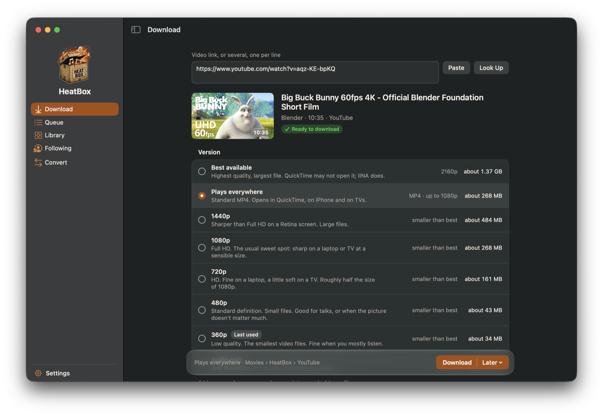
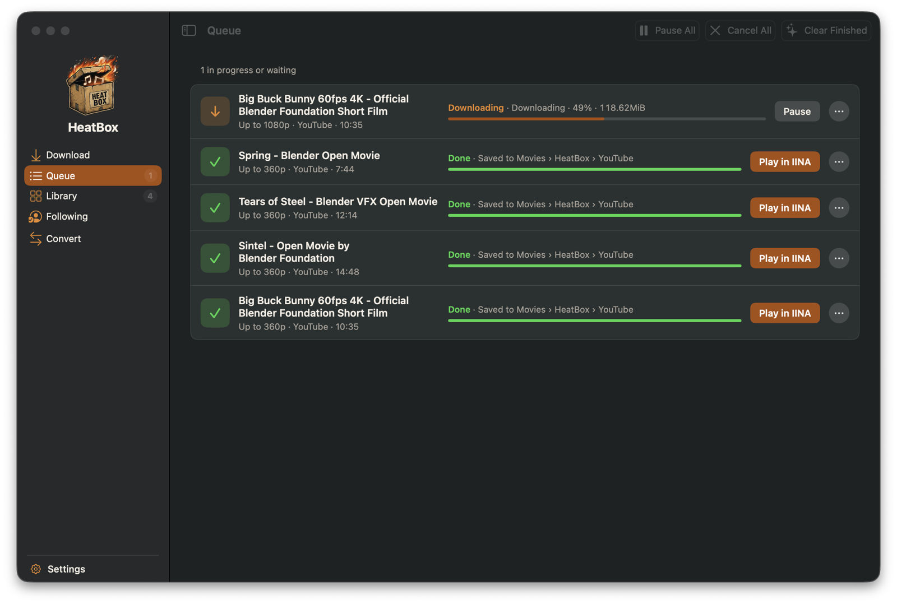
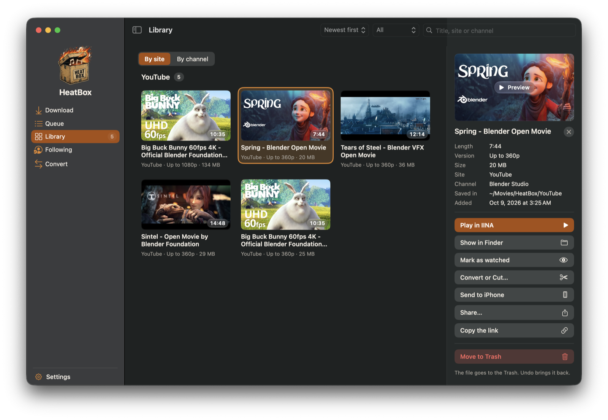
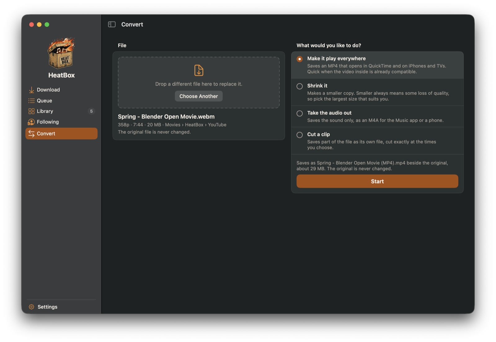

<p align="center">
  
</p>

<h1 align="center">HeatBox</h1>

<p align="center">
  A Mac app that saves videos and audio from the web in the quality you choose,<br>
  keeps a library of them, and converts files you already have.
</p>

<p align="center">
  <a href="../../releases/latest"><b>Download the latest release</b></a>
  &nbsp;·&nbsp; macOS 13 or later &nbsp;·&nbsp; Apple silicon and Intel &nbsp;·&nbsp; free, MIT licence
  <br>&nbsp;Not run on macOS 13 to 15, or on an Intel Mac, before release; see the [changelog](CHANGELOG.md).
</p>



## What it does

- **Paste a link, pick a version, press Download.** Each version says what it is good for and about how big the file will be. One video, several links, a playlist or a channel all work, on YouTube and the many other sites [yt-dlp](https://github.com/yt-dlp/yt-dlp) supports.
- **Only the part you want.** Cut a clip with a time bar, save each chapter as its own file, or take only the audio with tidy music tags and cover art.
- **A queue that looks after itself.** Pause and resume, schedule for later, automatic retries when the connection drops, and nothing lost if you quit.
- **A Library.** Everything you downloaded, with pictures, search, "watched" marks and, if you switch it on, a search of what was *said* in your videos.
- **Following.** Keep a list of channels and see what is new when you ask.
- **Convert.** Make any video play everywhere, shrink it, take the audio out or cut a clip. The original is never changed.
- **Full control when you want it.** Customize opens every option, shows the exact command that will run, and saves your choices as presets you can share.
- **It installs its own tools.** yt-dlp, FFmpeg and Deno are downloaded on request and checked against fixed fingerprints. Homebrew copies work too.

| | |
| --- | --- |
|  |  |
|  | **No accounts, no analytics, no server.** HeatBox collects nothing and sends nothing to its authors. What it connects to, and when, is listed in [docs/PRIVACY.md](docs/PRIVACY.md). |

## Install

1. **Download** `HeatBox-<version>-macos-universal.zip` from the [latest release](../../releases/latest) and open it.
2. **Drag HeatBox into your Applications folder.** If you have the app under its earlier name, Studio x Phobos, quit it and move it to the Trash first; your library, settings and queue are kept.
3. **Open it, and approve it once.** HeatBox is not signed with an Apple Developer ID and is not notarised, so macOS refuses the first time. Close the warning (do not move the app to the Trash), open **System Settings > Privacy & Security**, scroll down, press **Open Anyway** beside the message about HeatBox, and confirm. You do this once for each new version.
4. **Press "Install the Programs"** on the first screen. HeatBox downloads yt-dlp, FFmpeg and Deno, checks each one, and keeps them in its own folder.

To check that your download is the one that was published, compare it with the `.sha256` file beside it on the release page:

```sh
shasum -a 256 -c HeatBox-<version>-macos-universal.zip.sha256
```

The zip's own `Read Me First.txt` has the same steps, and how to use your own YouTube sign-in for members-only videos.

## Keyboard

| Keys | What they do |
| --- | --- |
| Cmd-1 to Cmd-5 | Download, Queue, Library, Following, Convert |
| Cmd-N, Cmd-K, Cmd-comma | New download, the command bar, Settings |
| Return, Cmd-Return | Look the link up; start the download |
| Tab, then the arrow keys | Move through a video's versions, or the Library's tiles |
| Space, Return, Esc (Library) | Preview, play, close the details |

With **System Settings > Keyboard > Keyboard navigation** on, Tab also reaches every button, as in any Mac app.

## A fair warning

Saving a video can be against a website's terms, and what you may do with a copy depends on where you live and who made it. Use HeatBox for your own viewing of things you are entitled to watch.

## Help, problems and security

- **Something does not work:** open an issue with the diagnostics file from **Settings > Tools > Save Diagnostics…** (it holds no links, titles, file names or user name).
- **A security problem:** please do not open a public issue. See [SECURITY.md](SECURITY.md).
- **Changing the code:** see [CONTRIBUTING.md](CONTRIBUTING.md).

## Build it yourself

Needs macOS 13 or later and either Xcode or only Apple's Command Line Tools. There are no package dependencies.

```sh
swift build                    # debug build
scripts/test.sh                # every test (the integration tests need: brew install yt-dlp ffmpeg deno)
scripts/lint.sh                # source rules the compiler does not enforce
scripts/build.sh               # dist/HeatBox.app for this Mac
scripts/build.sh --check       # ...and start it, wait for its window, quit it
scripts/build.sh --install     # ...and copy it to /Applications and open it
scripts/package.sh             # the release zip and its checksum in dist/
swift run StudioXPhobos        # run without a bundle (no notifications, no link scheme)
```

Add `--support-folder=<path>` after the program's name to try the app without touching your own queue, settings and Library.

```
Sources/Engine   Foundation only. Owns every decision.
Sources/App      SwiftUI and AppKit. Draws state, forwards what the person asks for.
Tests/EngineTests        unit and golden tests; no tool is run, no site is contacted
Tests/IntegrationTests   real yt-dlp, FFmpeg and ffprobe against a local test server
```

How it is put together, tested and released: [docs/ARCHITECTURE.md](docs/ARCHITECTURE.md), [docs/TESTING.md](docs/TESTING.md), [docs/RELEASING.md](docs/RELEASING.md).

## About the name

HeatBox was called Studio x Phobos up to version 1.0.0: one app made from two earlier ones, Phobos and YT-DLP Studio. A few names inside it are unchanged so that existing installs keep their data and their browser buttons: the `studioxphobos://` link scheme, the data folder `~/Library/Application Support/Studio x Phobos`, and the program's name in Activity Monitor, `StudioXPhobos`.

## Licence and credits

HeatBox is under the MIT licence ([LICENSE](LICENSE)). The programs it installs keep their own licences, listed in [Resources/NOTICES.txt](Resources/NOTICES.txt); FFmpeg's build is GPL-3.0-or-later.

The films in the screenshots are open movies by the Blender Foundation and Blender Studio (Big Buck Bunny, Sintel, Tears of Steel and Spring), licensed CC BY.
